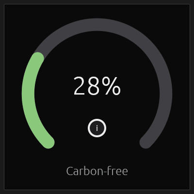

# Circular Progressbar Example

This example draws a circular, gauge-style progress bar with `egui_plot`.

## Features

- A 270° arc with a gap at the bottom: a colored progress arc over a gray track
- Rounded arc ends (thick polyline + a circular cap that matches the half-thickness)
- Centered percentage, a small info badge, and a caption
- The progress animates up from zero, with a **Restart** button and a **Speed** slider

## Usage

The arc sweeps clockwise from the lower-left up and around to the lower-right.
The green fill animates from 0 up to the **Target** value. **Speed** controls how
fast it rises, and **Restart** replays the animation from zero.



## Running

```bash
cargo run -p circular_progressbar
```
