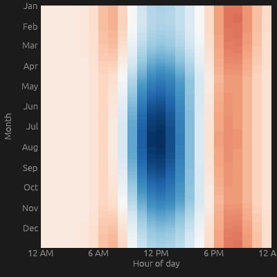

# Electricity Grid Demo

A calendar heatmap of household electricity usage, inspired by Mike Bostock's
[Electricity Usage, 2019](https://observablehq.com/@mbostock/electric-usage-2019).

Every tile is one hour of the year:

- **x-axis**: hour of the day (`12 AM` → `12 PM` → `12 AM`)
- **y-axis**: day of the year, grouped by month (January at the top)
- **color**: net power in kW on a diverging blue→white→red scale — **red** when
  drawing from the grid, **blue** when the solar panels export back to it

The data is synthetic: a baseline load with morning and evening peaks, summer
air-conditioning and winter heating, minus solar generation that follows the
daylight curve and the seasons.

## Controls

- **Peak solar capacity (kW)**: the maximum installed solar power. The demo
  animates the effective capacity from zero up to this value, so the midday band
  breathes between grid draw (red) and solar export (blue).

## Running

```bash
cargo run -p electricity_grid
```


